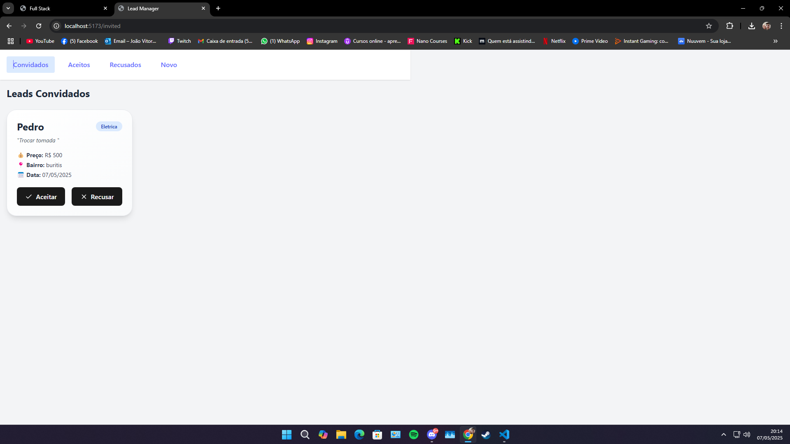
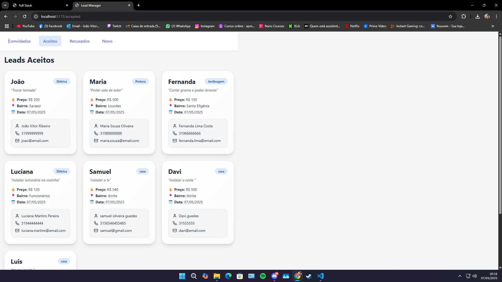
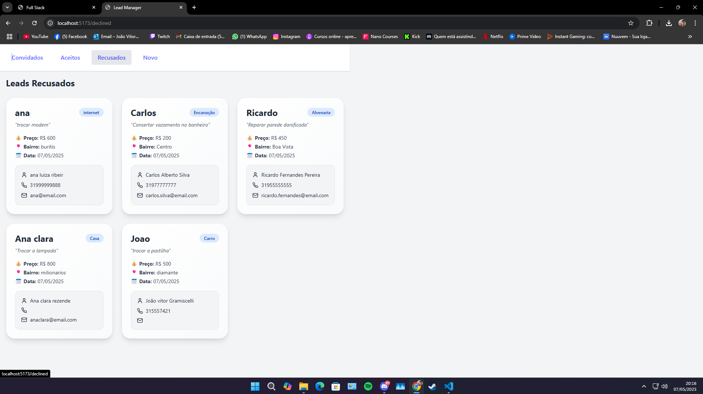
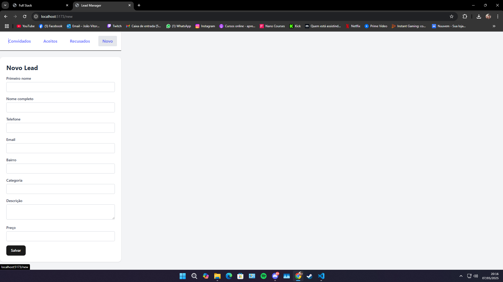

# 🚀 Desafio Full Stack .NET + React – Gerenciador de Leads

Este projeto é uma aplicação Full Stack desenvolvida como parte de um desafio técnico. O objetivo é gerenciar **leads de serviços** residenciais, permitindo **criar, visualizar, aceitar e recusar** propostas.

## 🧩 Funcionalidades

- [x] Criar novo lead
- [x] Listar leads convidados (`/invited`)
- [x] Aceitar ou recusar um lead
- [x] Visualizar leads aceitos (`/accepted`)
- [x] Visualizar leads recusados (`/declined`)
- [x] Aplicar 10% de desconto automático para serviços acima de R$ 500
- [x] Gravar notificação `.txt` ao aceitar um lead
- [x] Integração com banco de dados relacional **SQL Server**
- [x] Frontend estilizado com **Tailwind CSS**
- [x] Tratamento de erros e mensagens de feedback

## 📁 Estrutura de Pastas

```
Full Stack desafio/
│
├── api/           → Backend .NET (ASP.NET Core + EF Core)
├── web/           → Frontend React (Vite + TypeScript + Tailwind)
├── app/           → Lógica de domínio e serviços compartilhados
├── data/          → Contexto do banco e entidades EF
├── domain/        → Entidades e enums do domínio
```


## 🛠️ Tecnologias Utilizadas

### 🔙 Backend
- .NET 8
- ASP.NET Core
- Entity Framework Core
- SQL Server
- C#

### 🖼️ Frontend
- React
- Vite
- TypeScript
- Tailwind CSS
- Axios

---

## 💻 Como rodar o projeto

### ✅ 1. Clone o repositório

```bash
git clone https://github.com/JoaoVitor-Matos/FullStack-.Net-Desafio
cd "Full Stack desafio"
```

### ✅ 2. Configure a string de conexão 

Verifique o `appsettings.json` no projeto `api/`:

```json
"ConnectionStrings": {
  "DefaultConnection": "Server=localhost\\SQLEXPRESS;Database=LeadsDB;Trusted_Connection=True;TrustServerCertificate=True;"
}
```

### ✅ 3. Rode o backend (.NET API)

```bash
cd api
dotnet ef database update    # (apenas na primeira vez)
dotnet run
```

> A API ficará disponível em: `http://localhost:5085`

---

### ✅ 4. Rode o frontend (React)

```bash
cd web
npm install # (apenas na primeira vez)
npm run dev
```

> A interface estará em: `http://localhost:5173`

---

### ⚠️ Ajuste a porta da API no frontend

Verifique se a porta usada no backend (ex.: `http://localhost:5085`) está correta nos seguintes arquivos do frontend:

- `web/src/pages/new.tsx`
- `web/src/pages/declined.tsx`
- `web/src/services/leadService.ts`

Exemplo de ajuste:

```ts
const api = axios.create({
  baseURL: 'http://localhost:5085/api/leads'
});
```
---

## 🧪 Teste rápido

1. Vá para `http://localhost:5173`
2. Clique em **"Novo Lead"**
3. Preencha os campos e clique em **Salvar**
4. O novo lead aparecerá em `/invited`
5. Você poderá **aceitar** ou **recusar**
6. Os leads irão para `/accepted` ou `/declined`

## 📷 Prints






## ✅ Conclusão

Este projeto demonstra o domínio de:
- Criação de APIs REST com ASP.NET Core
- Integração com bancos relacionais via EF Core
- Desenvolvimento frontend moderno com React e Tailwind
- Comunicação entre front e back com Axios
- Princípios de Clean Code e separação por camadas
